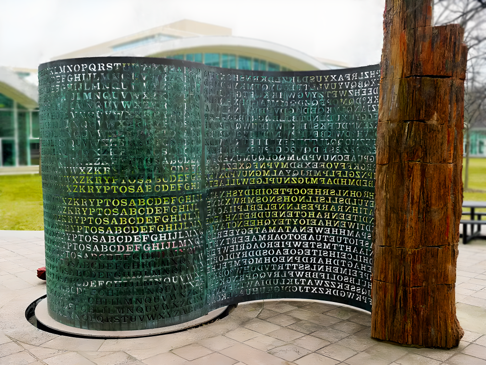

  

# Attempt at solving the Langley Kryptos

## Dictionary brute-forcing Vigenère keys
```
python3 k1k2_bruteforce.py
k1 palimpsest score: 3.1 took: 1.376 seconds
k2 abscissa score: 4.1 took: 1.219 seconds
k1 Found typo fix key: palimpcest took: 0.013 seconds
k2 Found typo fix key: abvcissa took: 0.041 seconds
```

 
## Transposition cipher bruteforcing
```
Doesn't usually find the simplest solution
python3 k3_bruteforce.py
['reshape 21 16', 'reshape 21 16', 'reshape 8 42', 'counterclockwise', 'reshape 24 14', 'counterclockwise'] score: 3.7 took: 0.6 seconds
```

License: CC0
